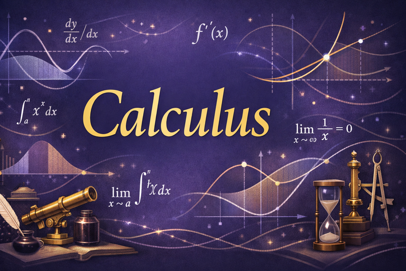

# Calculus

A fun simulation-filled interactive intelligent college placement Calculus textbook that is designed to maximize the odds that you will get college credit and have a blast using the textbook.

!!! note
    AP® is a registered trademark of the College Board, which is not affiliated with, and does not endorse, this product.
