# MicroSims Gallery

Interactive educational simulations for exploring calculus concepts.
Each MicroSim focuses on a single learning objective and provides immediate visual feedback.

-   **[Accumulation Function Explorer](./accumulation-function/index.md)**

    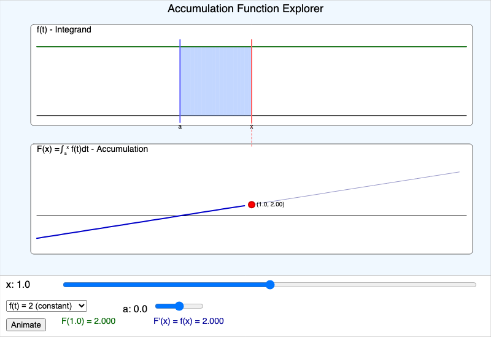

    Visualize how the accumulation function F(x) = integral from a to x of f(t) dt grows as x moves across the interval.

-   **[Additivity Property Visualization](./additivity-property/index.md)**

    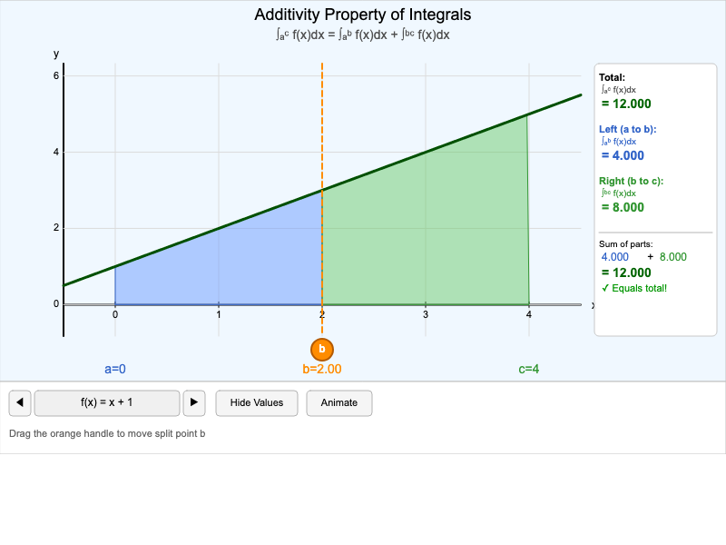

    Demonstrates how the area under a curve can be split into sub-regions that sum to the total, illustrating the additivity property of definite integrals.

-   **[Family of Antiderivatives](./antiderivative-family/index.md)**

    

    Interactive visualization showing how different values of the constant C produce a family of parallel antiderivative curves. All antiderivatives of a function differ only by a constant.

-   **[Asymptote Analyzer](./asymptote-analyzer/index.md)**

    

    Explore vertical and horizontal asymptotes of rational functions.

-   **[Asymptote Behavior Visualization](./asymptote-behavior/index.md)**

    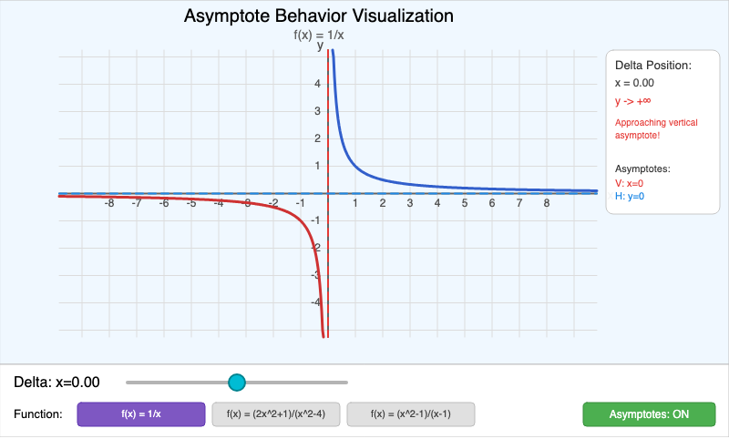

    Interactive visualization showing how rational functions behave near vertical asymptotes and as x approaches infinity, featuring Delta the robot traveling along curves.

-   **[All Three Asymptote Types](./asymptote-types/index.md)**

    

    Interactive comparison of vertical, horizontal, and oblique asymptotes showing their defining characteristics and behavior.

-   **[Average Rate of Change Explorer](./average-rate-change/index.md)**

    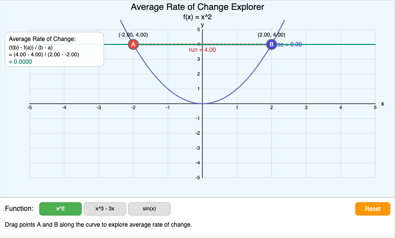

    An interactive MicroSim that allows students to explore average rate of change by dragging two points along a curve and observing the secant line and slope calculation update in real-time.

-   **[Average Value of a Function](./average-value/index.md)**

    

    Interactive visualization showing the average value of a function as the height of a rectangle with equal area to the region under the curve.

-   **[Balloon Inflation Simulator](./balloon-inflation-simulator/index.md)**

    

    An interactive MicroSim that helps students compare how the rate of radius change varies with different radii and volume flow rates, discovering the inverse relationship between dr/dt and r squared.

-   **[Box Volume Optimizer](./box-optimizer/index.md)**

    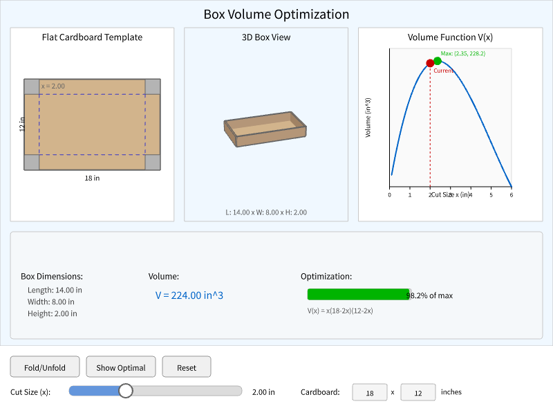

    Interactive MicroSim demonstrating how cutting squares from cardboard corners affects the volume of the resulting box. Students examine the optimization problem V(x) = x(L-2x)(W-2x).

-   **[Can Optimizer](./can-optimizer/index.md)**

    

    An interactive MicroSim demonstrating optimization by exploring how cylinder radius affects surface area for a fixed volume, helping students calculate optimal can dimensions.

-   **[Candidates Test Calculator](./candidates-test/index.md)**

    

    An interactive step-by-step guide through the closed interval method for finding global extrema on closed intervals.

-   **[Chain Rule Steps](./chain-rule-steps/index.md)**

    

    Interactive step-by-step guide to applying the chain rule for differentiating composite functions with color-coded visualization of inside and outside functions.

-   **[Changing Bounds in u-Substitution](./changing-bounds/index.md)**

    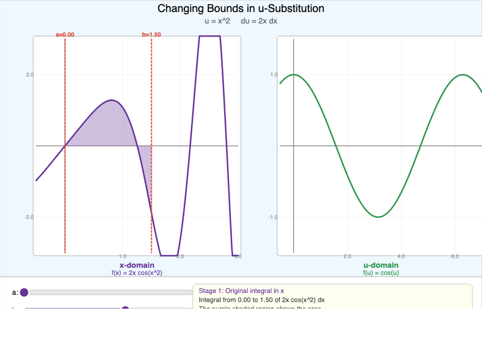

    Interactive visualization showing how integration bounds transform from x-domain to u-domain during u-substitution, with side-by-side graphs confirming area equality.

-   **[Closed Interval Method](./closed-interval-method/index.md)**

    

    Interactive MicroSim demonstrating the Closed Interval Method for finding absolute extrema on closed intervals through a step-by-step guided process.

-   **[Closest Point Finder](./closest-point-finder/index.md)**

    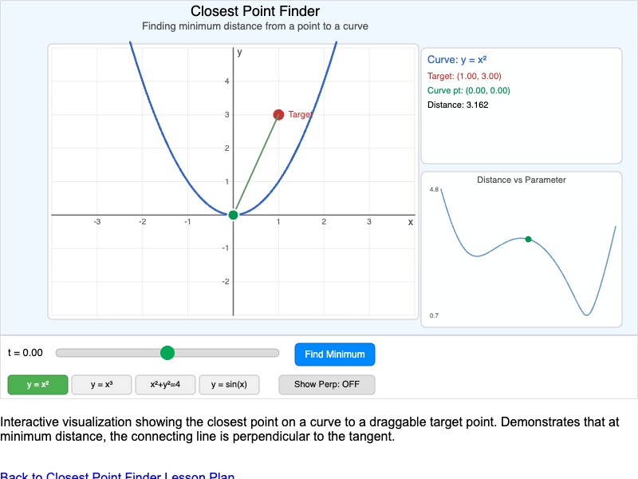

    An interactive MicroSim that finds the minimum distance from a draggable target point to various curves, demonstrating that at the closest point, the connecting line is perpendicular to the tangent.

-   **[Complete Curve Sketch](./complete-curve-sketch/index.md)**

    

    Interactive MicroSim demonstrating the complete curve sketching process, building graphs step-by-step with intercepts, asymptotes, extrema, and concavity.

-   **[Composite Function Identifier](./composite-identifier/index.md)**

    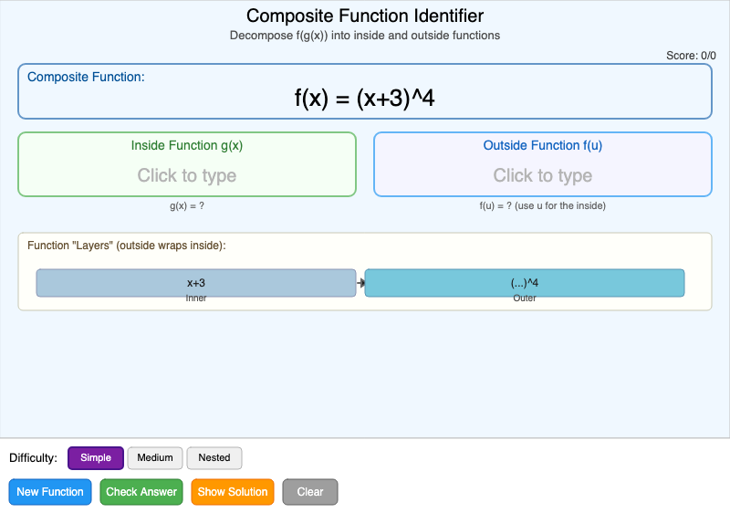

    An interactive MicroSim for training students to recognize composite functions and decompose them into inside (g) and outside (f) functions, preparing them for the chain rule.

-   **[Concavity Explorer](./concavity-explorer/index.md)**

    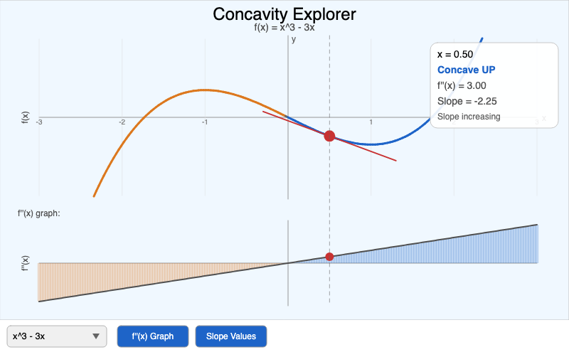

    Interactive MicroSim exploring concave up and concave down regions by dragging a point along a curve and observing how the tangent line slope changes in relation to the second derivative.

-   **[Conical Tank Draining](./conical-tank-draining/index.md)**

    

    Interactive visualization of related rates for water draining from a conical tank, showing similar triangles relationship between radius and height.

-   **[Three Conditions for Continuity](./continuity-conditions/index.md)**

    

    An interactive MicroSim that helps students explain how each of the three continuity conditions corresponds to visual features of a function graph.

-   **[Coordinate System Explorer](./coordinate-system-explorer/index.md)**

    

    Interactive exploration of the Cartesian coordinate plane with point placement and quadrant identification.

-   **[Critical Point Finder](./critical-point-finder/index.md)**

    

    Interactive MicroSim to help students identify critical points by finding where f'(x) = 0 or f'(x) does not exist, with step-by-step solutions.

-   **[Curve Analysis Dashboard](./curve-analysis-dashboard/index.md)**

    

    Complete interactive visualization showing how to fully analyze a function using derivatives, including critical points, inflection points, concavity, and increasing/decreasing intervals.

-   **[Derivative from Graph](./derivative-from-graph/index.md)**

    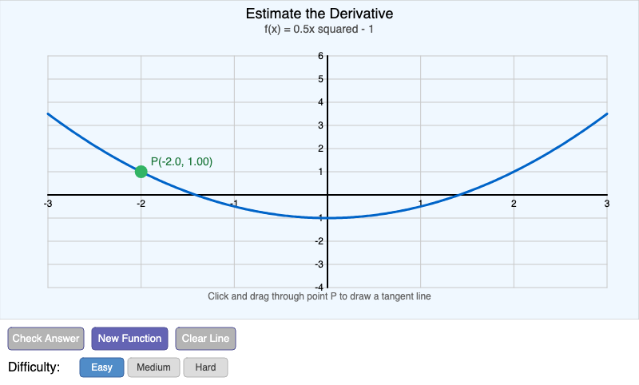

    Practice estimating derivatives by drawing tangent lines on curves and comparing your estimated slope to the actual derivative value.

-   **[Derivative Information Flow](./derivative-info-flow/index.md)**

    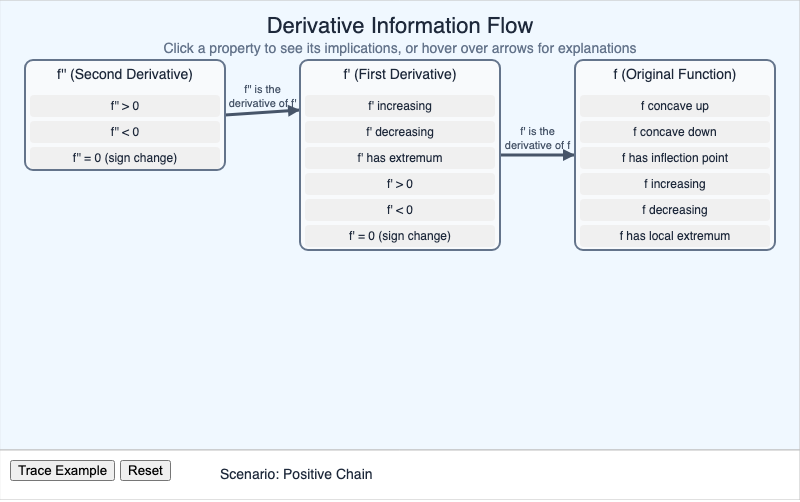

    Interactive diagram showing how information about function behavior flows from the second derivative to the first derivative to the original function.

-   **[Derivative Interpretation Selector](./derivative-interpretation/index.md)**

    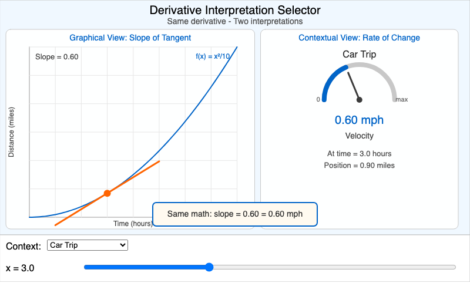

    Interactive MicroSim showing the derivative as both slope (graphical) and rate of change (contextual).

-   **[Derivative Test Comparison](./derivative-test-comparison/index.md)**

    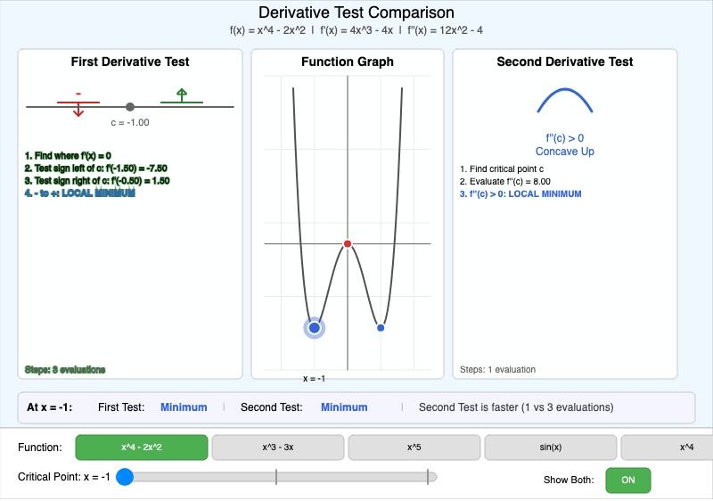

    An interactive comparison tool showing the First and Second Derivative Tests side-by-side for classifying critical points.

-   **[First vs Second Derivative Test](./derivative-tests-comparison/index.md)**

    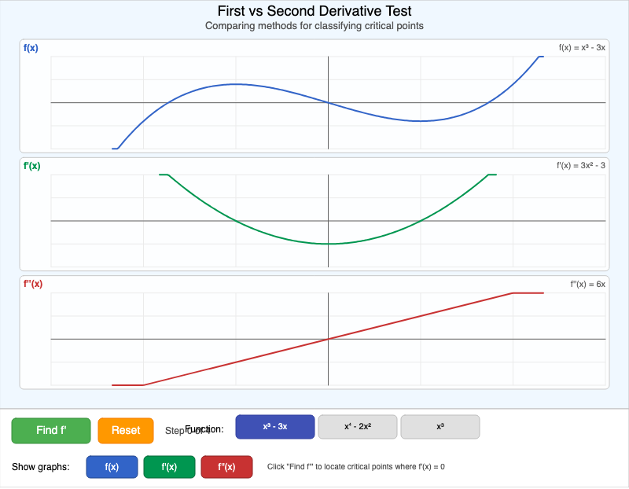

    An interactive MicroSim comparing the First Derivative Test and Second Derivative Test methods for classifying critical points of functions.

-   **[Differentiability vs Continuity](./diff-cont-relationship/index.md)**

    

    Interactive Venn diagram showing the set relationship between differentiable and continuous functions.

-   **[Differentiability Checker](./differentiability-checker/index.md)**

    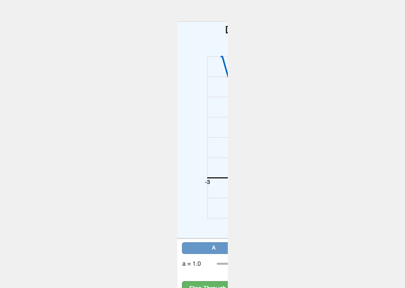

    Step-through tool for checking differentiability at a point.

-   **[Direct Substitution Decision Tree](./direct-substitution-tree/index.md)**

    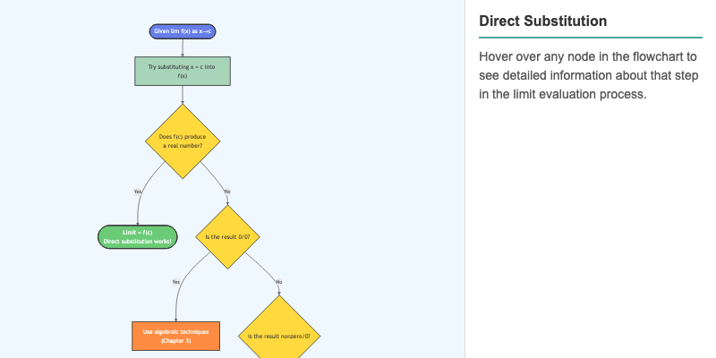

    Interactive flowchart guiding students through the decision process for evaluating limits.

-   **[Direction of Motion Analyzer](./direction-of-motion-analyzer/index.md)**

    

    Interactive MicroSim analyzing when an object moves in positive vs negative direction based on the sign of velocity.

-   **[Discontinuity Classification](./discontinuity-types/index.md)**

    

    An interactive MicroSim for classifying discontinuities by analyzing limit behavior at specific points.

-   **[Domain and Range Visualizer](./domain-range-visualizer/index.md)**

    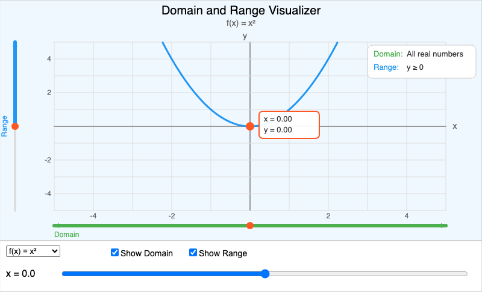

    An interactive MicroSim that helps students interpret domain and range graphically by showing function graphs with highlighted number lines.

-   **[End Behavior Explorer](./end-behavior/index.md)**

    

    Interactive MicroSim for examining how leading term characteristics determine the end behavior of polynomial and rational functions.

-   **[Even and Odd Function Integral Symmetry](./even-odd-integrals/index.md)**

    

    Interactive visualization showing how symmetry properties of even and odd functions affect definite integrals over symmetric intervals.

-   **[EVT Conditions Explorer](./evt-conditions/index.md)**

    

    Interactive visualization showing why the Extreme Value Theorem requires both continuity and a closed interval, with counterexamples.

-   **[Exponential and Logarithm Relationship](./exp-log-relationship/index.md)**

    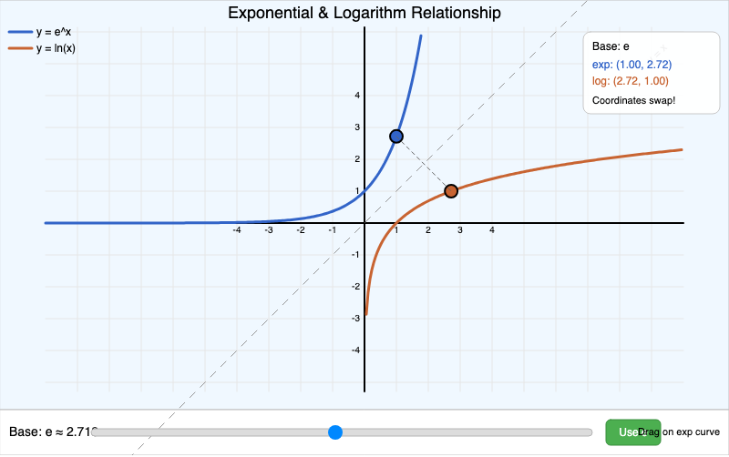

    Compare exponential and logarithmic functions as inverses reflected across y = x.

-   **[e^x is Its Own Derivative](./exp-self-derivative/index.md)**

    

    Interactive MicroSim demonstrating that the exponential function e^x is unique because its derivative equals the function itself.

-   **[Exponential Integrals](./exponential-integrals/index.md)**

    

    Interactive visualization demonstrating how the integral of a^x depends on the base a and why dividing by ln(a) is necessary.

-   **[Global vs Local Extrema Visualizer](./extrema-types/index.md)**

    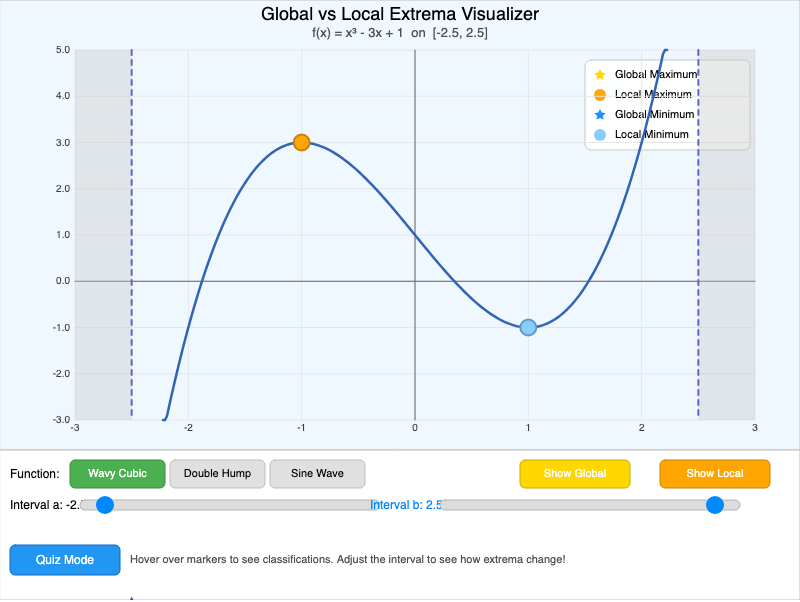

    Interactive MicroSim helping students distinguish between global and local maxima/minima on function graphs.

-   **[Factoring Technique for Limits](./factoring-limits/index.md)**

    

    Visualize how factoring and canceling common factors reveals limit values.

-   **[Fencing Problem Optimizer](./fencing-optimizer/index.md)**

    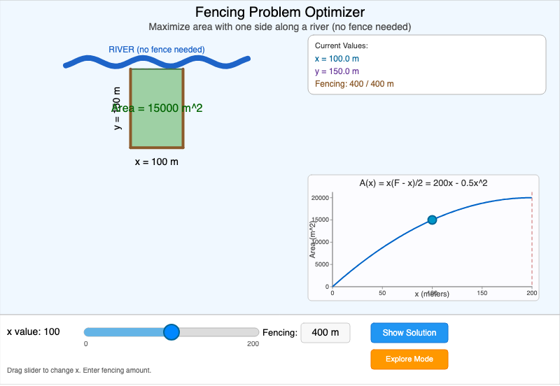

    An interactive MicroSim for visualizing and solving the classic fencing optimization problem.

-   **[FTC Connection Visualization](./ftc-connection/index.md)**

    

    Visualize how FTC Part 1 and Part 2 are two sides of the same relationship between differentiation and integration.

-   **[FTC Part 1 Calculator](./ftc-part1-calculator/index.md)**

    

    Practice applying the Fundamental Theorem of Calculus Part 1 to find derivatives of accumulation functions.

-   **[FTC Part 2 Step-by-Step Evaluator](./ftc-part2-evaluator/index.md)**

    

    Walk through the FTC Part 2 evaluation process step by step to evaluate definite integrals.

-   **[Function Composition Visualizer](./function-composition/index.md)**

    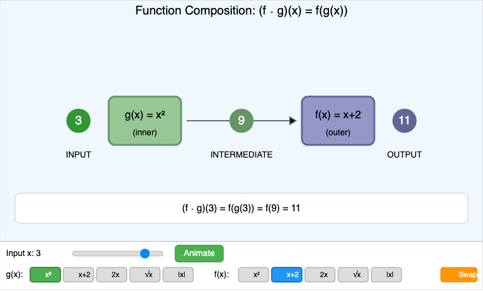

    Interactive visualization showing how composite functions work by tracing values through two function machines in sequence.

-   **[Function and Derivative Comparison](./function-derivative-comparison/index.md)**

    

    Interactive side-by-side visualization showing a function and its derivative with synchronized point and tangent line displays.

-   **[Function Machine](./function-machine/index.md)**

    

    An interactive MicroSim demonstrating how functions process inputs to produce exactly one output.

-   **[Learning Graph Viewer](./graph-viewer/index.md)**

    

    Interactive visualization of the course concept dependency learning graph.

-   **[Graphical Inverse Derivatives](./graphical-inverse-derivatives/index.md)**

    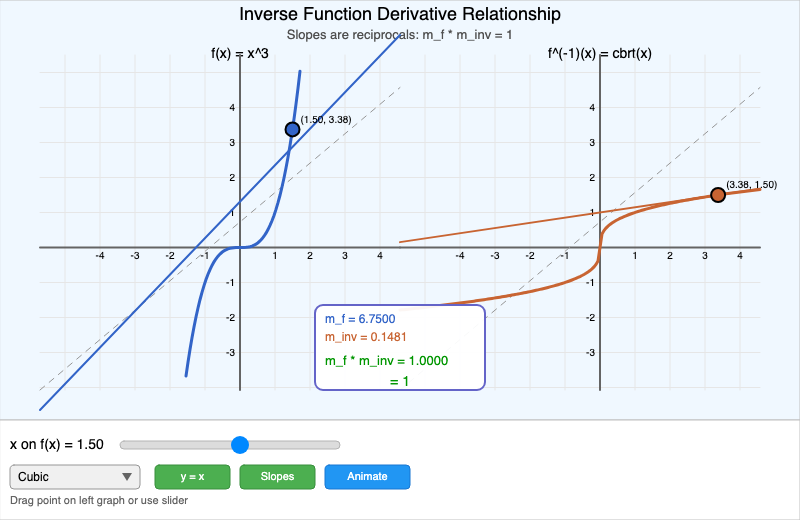

    Interactive visualization showing the relationship between a function and its inverse, with tangent lines demonstrating the reciprocal slope property.

-   **[Growth Rate Comparison](./growth-rates/index.md)**

    

    Compare growth rates of logarithmic, polynomial, and exponential functions to understand which dominates as x approaches infinity.

-   **[Implicit Curves Explorer](./implicit-curves/index.md)**

    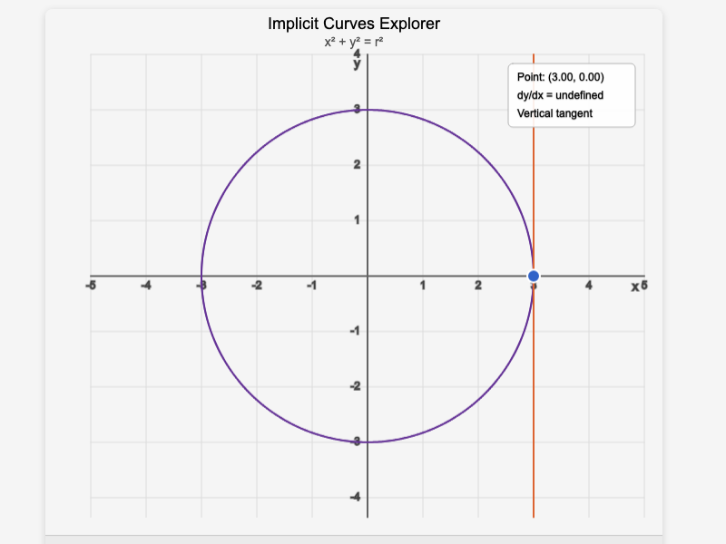

    Interactive visualization of implicit curves with tangent lines.

-   **[Implicit Differentiation Steps](./implicit-diff-steps/index.md)**

    

    Interactive step-by-step visualization of the implicit differentiation process with color-coded terms.

-   **[Implicit Tangent Line Explorer](./implicit-tangent/index.md)**

    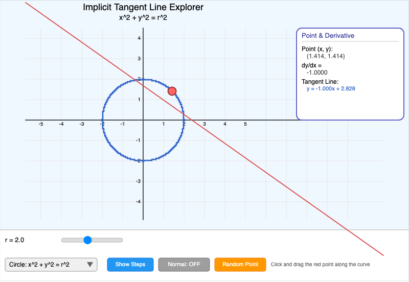

    Interactive exploration of tangent lines to curves defined by implicit equations, including circles, ellipses, hyperbolas, and the Folium of Descartes.

-   **[Integration Strategy Decision Flowchart](./integration-strategy/index.md)**

    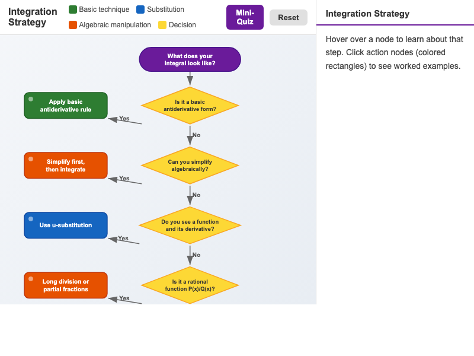

    An interactive decision tree that guides students through choosing the right integration technique.

-   **[Integration Verifier](./integration-verifier/index.md)**

    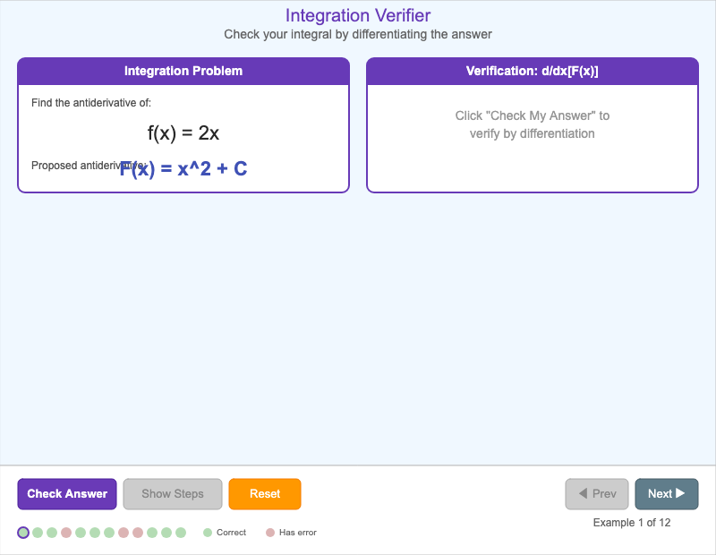

    Interactive tool to verify integration results by differentiating the proposed antiderivative and comparing to the original integrand.

-   **[Derivative of Inverse Functions](./inverse-derivative/index.md)**

    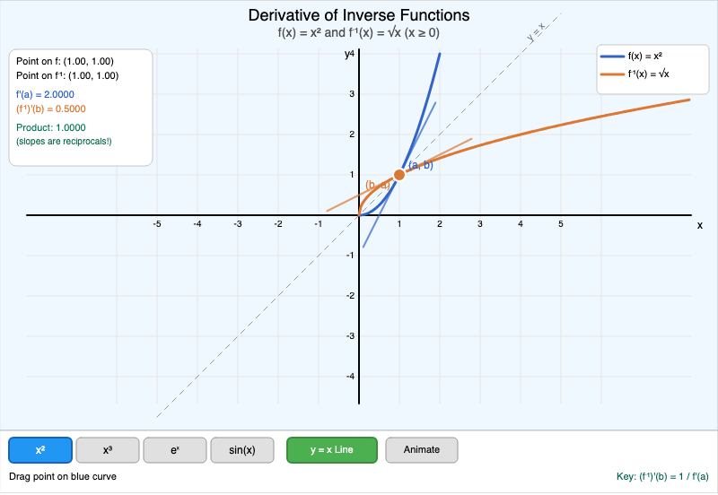

    Interactive visualization showing geometrically why the derivative of an inverse function equals the reciprocal of the original derivative.

-   **[Inverse Function Reflector](./inverse-function-reflector/index.md)**

    

    Compare functions and their inverses graphically, seeing the reflection relationship across y = x.

-   **[Inverse Trig Derivatives Quiz](./inverse-trig-derivatives-quiz/index.md)**

    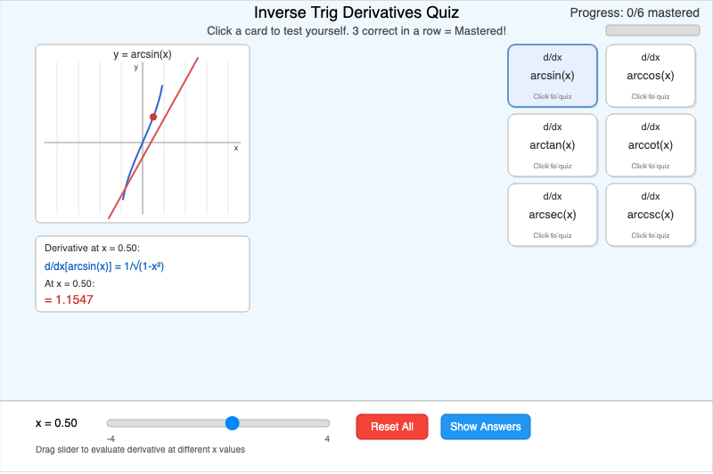

    Interactive flashcard-style quiz to help students memorize and apply the six inverse trigonometric derivative formulas.

-   **[Inverse Trig Domains](./inverse-trig-domains/index.md)**

    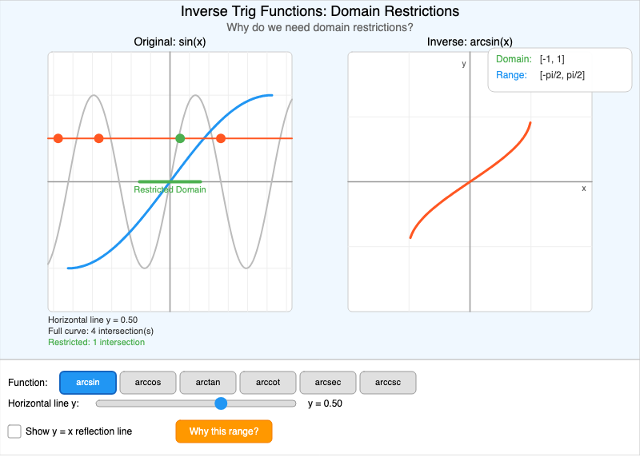

    Visualize why domain restrictions are necessary for inverse trigonometric functions using the horizontal line test.

-   **[Inverse Trig Integral Pattern Matcher](./inverse-trig-integral-match/index.md)**

    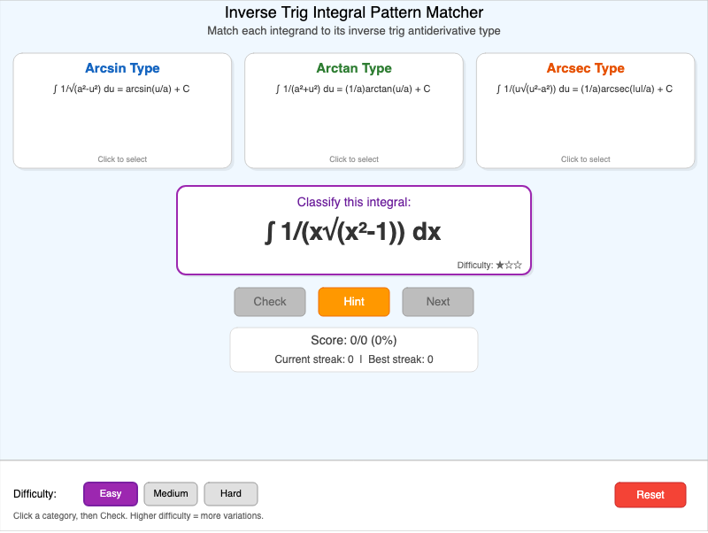

    Match integrands to their corresponding inverse trigonometric antiderivative types through interactive pattern recognition.

-   **[Intermediate Value Theorem Visualization](./ivt-visualization/index.md)**

    

    Interactive visualization demonstrating the IVT with Delta robot traveling along continuous functions.

-   **[Ladder Problem Explorer](./ladder-problem-explorer/index.md)**

    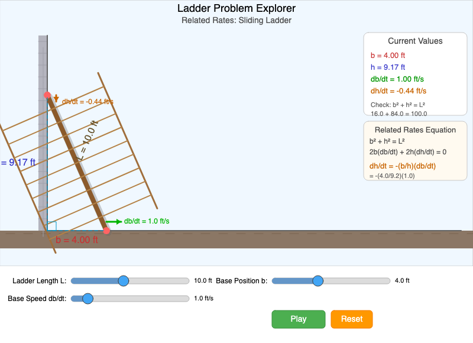

    Interactive visualization of the classic related rates ladder problem.

-   **[Left vs Right Riemann Sums](./left-right-riemann/index.md)**

    

    Interactive comparison of left and right Riemann sum approximations showing when each method overestimates or underestimates.

-   **[L'Hospital's Rule Visualizer](./lhospitals-rule-visualizer/index.md)**

    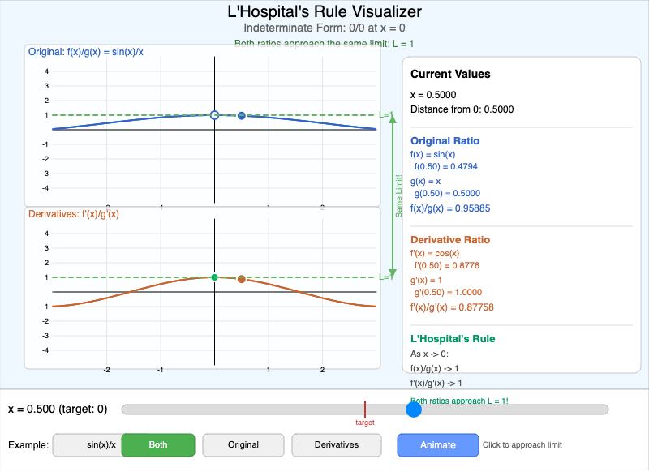

    Interactive visualization showing how L'Hospital's Rule transforms indeterminate limits.

-   **[Limit Laws Practice](./limit-laws-practice/index.md)**

    

    Interactive practice problems for applying limit laws to evaluate limits algebraically.

-   **[Limit Visualization with Hole](./limit-with-hole/index.md)**

    

    Interactive visualization showing how function values approach a limit even when the function has a hole.

-   **[Limits from Graphs Practice](./limits-from-graphs/index.md)**

    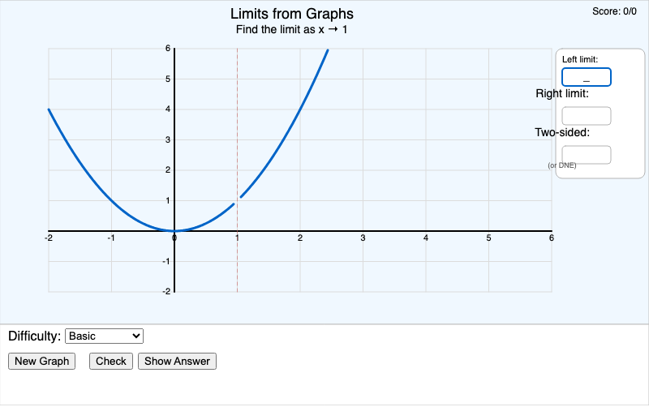

    Practice reading left-hand, right-hand, and two-sided limits from graphical representations.

-   **[Linear Approximation Error](./linear-approx-error/index.md)**

    

    Assess the accuracy of linear approximations by comparing the approximation to the actual function value.

-   **[ln(x) as Area Under 1/t](./ln-as-area/index.md)**

    

    Interactive visualization showing the natural logarithm as the accumulated area under the curve y = 1/t.

-   **[Local Linearity](./local-linearity/index.md)**

    

    Interactive MicroSim demonstrating how curves appear linear when zoomed in sufficiently.

-   **[Logarithmic Differentiation](./logarithmic-differentiation/index.md)**

    

    Step-by-step guide through the logarithmic differentiation process with color-coded transformations.

-   **[Marginal Analysis Calculator](./marginal-analysis-calculator/index.md)**

    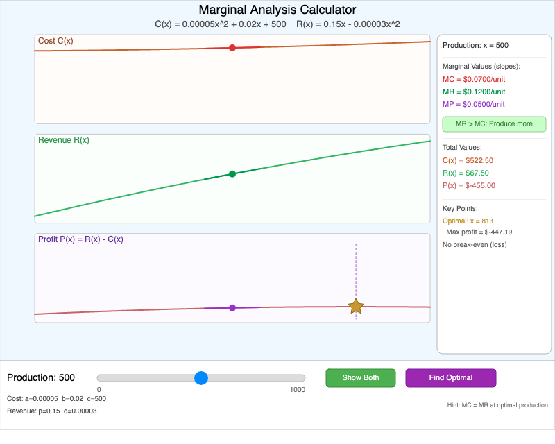

    Interactive visualization for calculating and interpreting marginal cost, revenue, and profit.

-   **[Marginal Cost Analyzer](./marginal-cost-analyzer/index.md)**

    

    Interactive MicroSim that calculates and interprets marginal cost as the derivative of the cost function.

-   **[Motion Analysis](./motion-analysis/index.md)**

    

    Interactive visualization showing the relationship between position, velocity, and acceleration.

-   **[Multi-Rule Derivative Builder](./multi-rule-builder/index.md)**

    

    An interactive step-by-step tool showing how multiple derivative rules combine to differentiate complex functions.

-   **[Mean Value Theorem Explorer](./mvt-explorer/index.md)**

    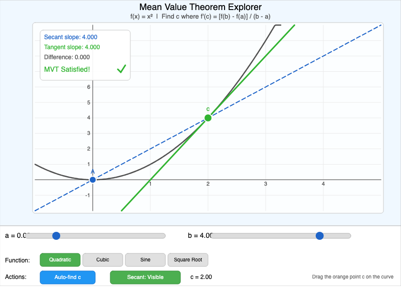

    Interactive visualization of the Mean Value Theorem showing secant lines, tangent lines, and the values of c.

-   **[Nested Chain Rule Unwrap](./nested-chain-unwrap/index.md)**

    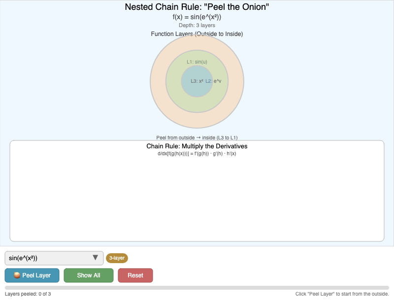

    An interactive visualization of nested function differentiation using the chain rule.

-   **[Net Signed Area Visualizer](./net-signed-area/index.md)**

    

    Demonstrates that definite integrals compute net signed area, with regions below the x-axis contributing negatively.

-   **[Non-Differentiable Points Gallery](./non-differentiable-gallery/index.md)**

    

    Interactive gallery showing the three types of non-differentiable points with animated secant lines.

-   **[One-Sided Derivatives](./one-sided-derivatives/index.md)**

    

    Interactive visualization showing how left and right secant lines approach a point.

-   **[One-Sided Limits Comparison](./one-sided-limits/index.md)**

    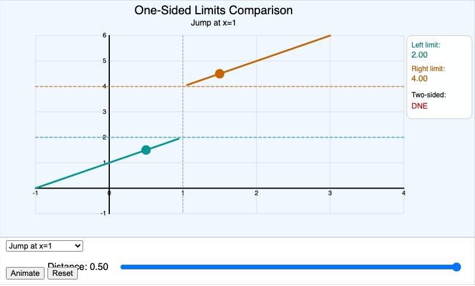

    Compare left-hand and right-hand limits to determine whether a two-sided limit exists.

-   **[Optimization Problem Setup Flowchart](./optimization-flowchart/index.md)**

    

    An interactive flowchart showing the step-by-step process for setting up optimization problems.

-   **[Piecewise Function Builder](./piecewise-builder/index.md)**

    

    Construct piecewise functions by defining different rules for different domains.

-   **[Piecewise Continuity Explorer](./piecewise-continuity/index.md)**

    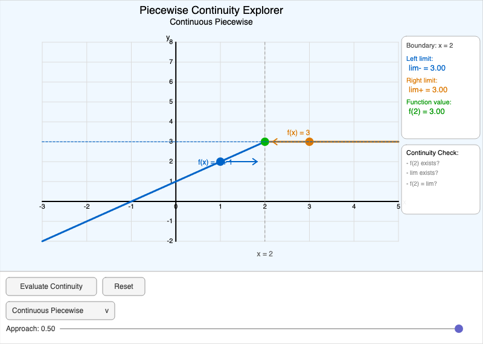

    Interactive MicroSim for determining whether piecewise functions are continuous at boundary points.

-   **[Polynomial Explorer](./polynomial-explorer/index.md)**

    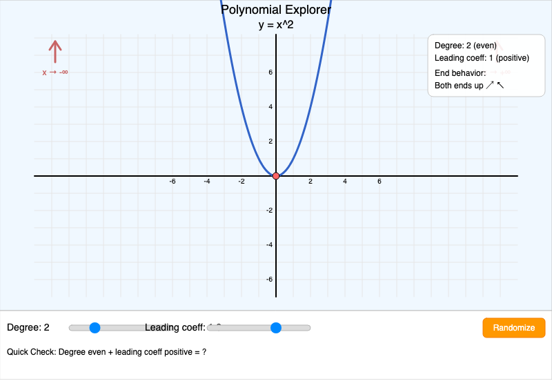

    Examine how polynomial degree and leading coefficient affect graph shape and end behavior.

-   **[Polynomial Integration](./polynomial-integration/index.md)**

    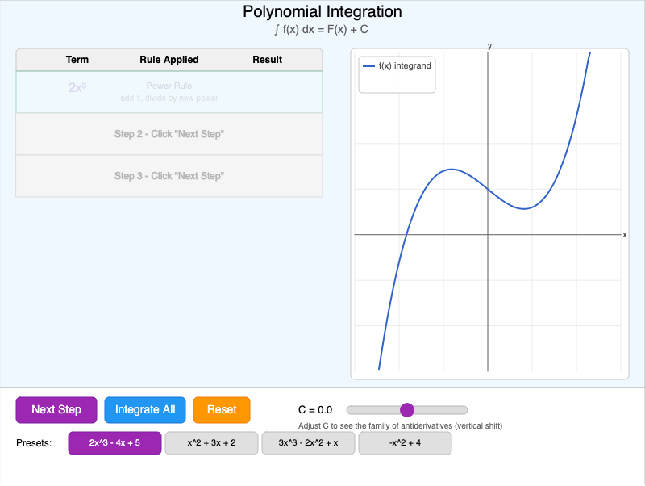

    Interactive step-by-step guide to integrating polynomial functions using the power rule.

-   **[Power Rule Explorer](./power-rule-explorer/index.md)**

    

    Interactive visualization of the power rule showing f(x) = x^n and its derivative f'(x) = nx^(n-1).

-   **[Power Rule Integration](./power-rule-integration/index.md)**

    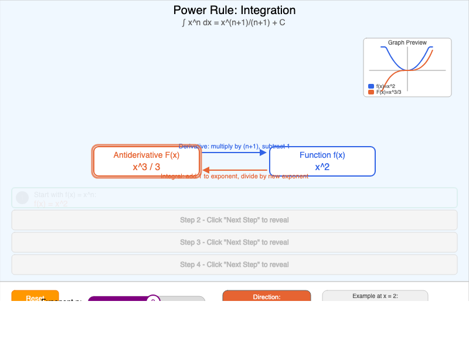

    Interactive visualization showing the relationship between derivative and integral power rules.

-   **[Product Rule Visualization](./product-rule-viz/index.md)**

    

    Interactive geometric visualization of the product rule showing why d(fg) = f*dg + g*df.

-   **[Profit Optimizer](./profit-optimizer/index.md)**

    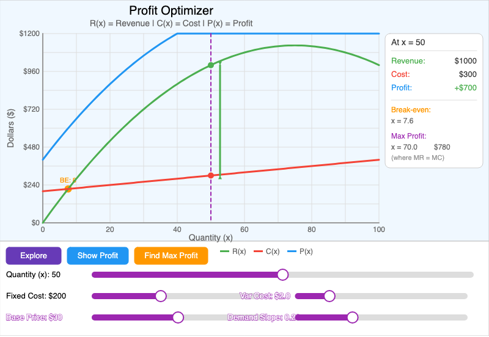

    Interactive MicroSim showing the relationship between revenue, cost, and profit functions.

-   **[Rate Interpretation Dashboard](./rate-interpretation-dashboard/index.md)**

    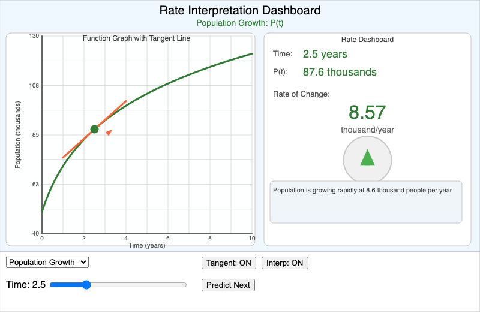

    Interactive dashboard for interpreting derivative values in context across multiple real-world scenarios.

-   **[Four Riemann Sum Methods Comparison](./riemann-sum-methods/index.md)**

    

    Compare left, right, midpoint, and trapezoidal Riemann sum methods.

-   **[Rolle's Theorem Visualizer](./rolles-theorem/index.md)**

    

    Interactive visualization of Rolle's Theorem showing guaranteed existence of horizontal tangent lines.

-   **[Differentiation Rule Selector](./rule-selector/index.md)**

    

    An interactive decision tree that helps students choose the appropriate differentiation rule.

-   **[Secant Lines Approaching Tangent Line](./secant-to-tangent/index.md)**

    

    Interactive visualization showing how secant lines approach the tangent line as h approaches 0.

-   **[Second Derivative Explorer](./second-derivative-explorer/index.md)**

    

    Interactive visualization showing f(x), f'(x), and f''(x) in three synchronized panels.

-   **[Sigma Notation Visualizer](./sigma-notation-visualizer/index.md)**

    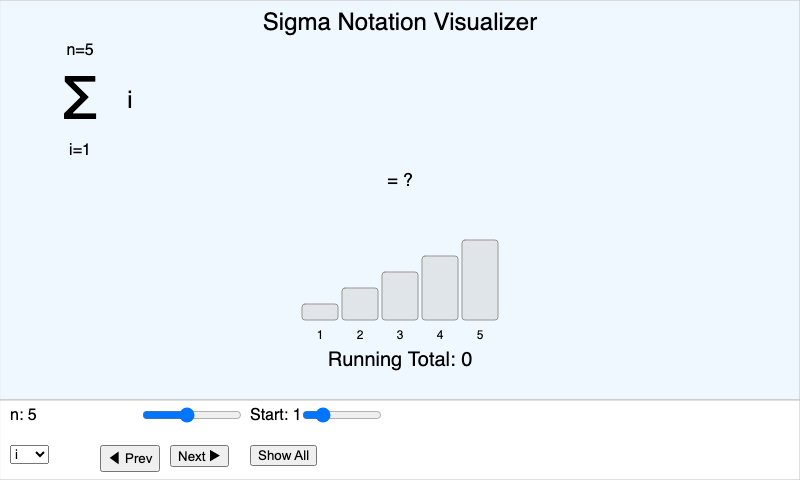

    Interactive MicroSim that helps students understand sigma notation by expanding sums and calculating totals step by step.

-   **[Sign Chart Builder](./sign-chart-builder/index.md)**

    

    Construct sign charts for derivatives to determine intervals of increase and decrease.

-   **[Sin(x)/x Visualization](./sinx-over-x/index.md)**

    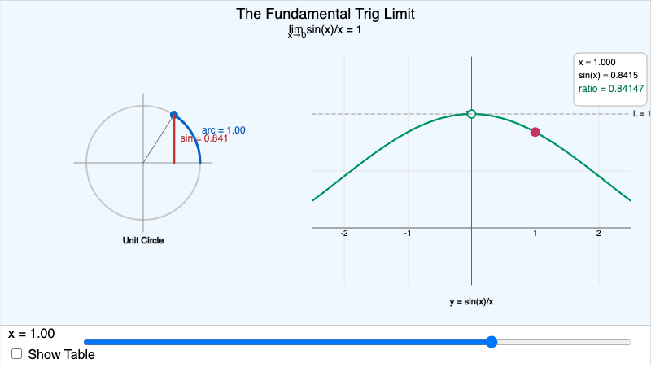

    Understand the fundamental trigonometric limit using unit circle and graph visualizations.

-   **[Sketch from Derivative Info](./sketch-from-info/index.md)**

    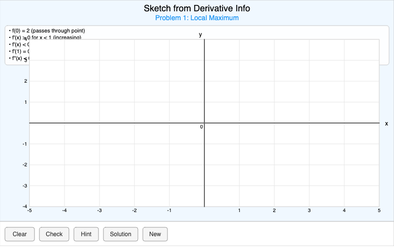

    Students construct function graphs given only derivative information.

-   **[Speed Change Analyzer](./speed-change-analyzer/index.md)**

    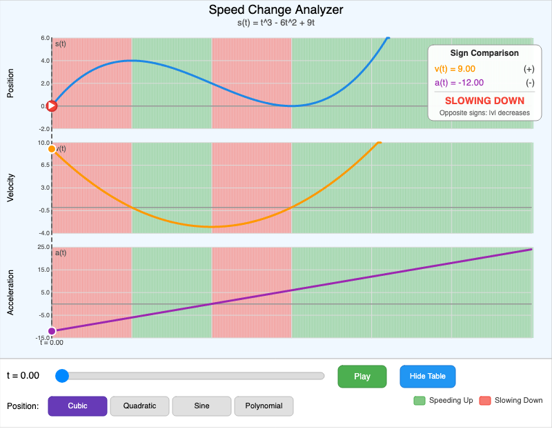

    Interactive MicroSim showing when an object speeds up vs slows down based on velocity and acceleration signs.

-   **[Squeeze Theorem Visualization](./squeeze-theorem/index.md)**

    

    Interactive demonstration of how the Squeeze Theorem pins down limit values.

-   **[Tangent Line Calculator](./tangent-line-calculator/index.md)**

    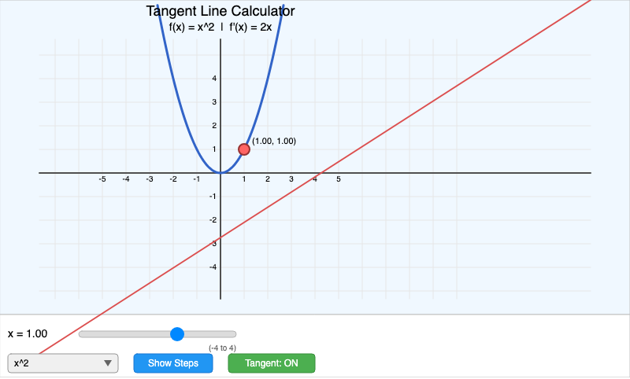

    Given a function and a point, shows step-by-step calculation of the tangent line equation.

-   **[Term by Term Differentiation](./term-by-term-diff/index.md)**

    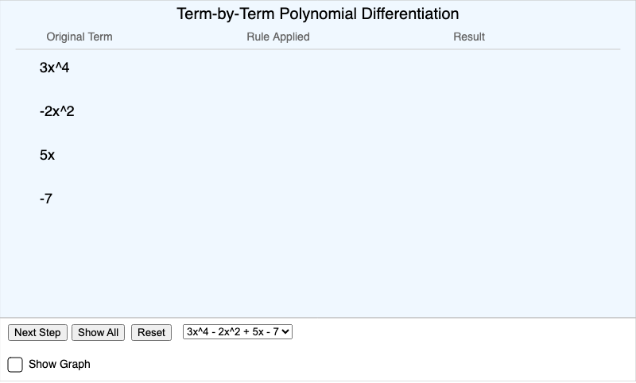

    An interactive MicroSim showing how polynomial differentiation works term by term.

-   **[Three Connected Graphs Explorer](./three-graphs-explorer/index.md)**

    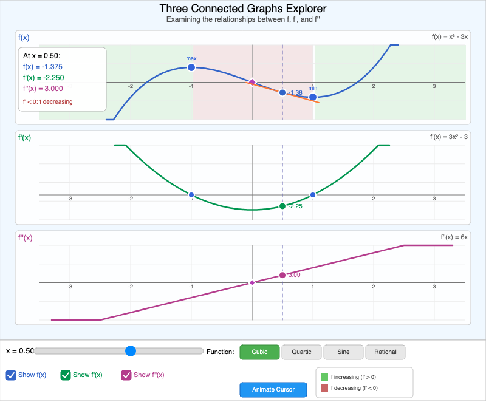

    Interactive visualization showing f(x), f'(x), and f''(x) simultaneously with synchronized cursor.

-   **[Timeline of Calculus History](./timeline/index.md)**

    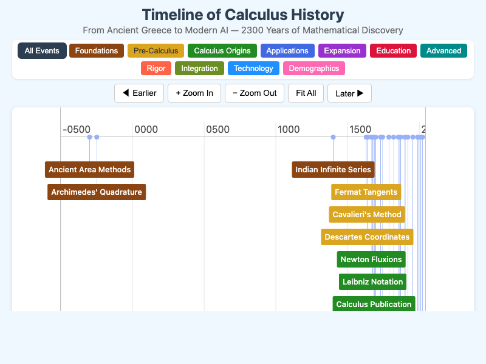

    An interactive timeline showing 2300 years of calculus development.

-   **[Transcendental Integral Practice](./transcendental-integral-practice/index.md)**

    

    Interactive practice with transcendental integrals including trig, exponential, logarithmic, and inverse trig functions.

-   **[Transformation Playground](./transformation-playground/index.md)**

    

    Manipulate a, b, h, k parameters to transform parent functions and see the effects in real-time.

-   **[Trig Derivative Cycle](./trig-derivative-cycle/index.md)**

    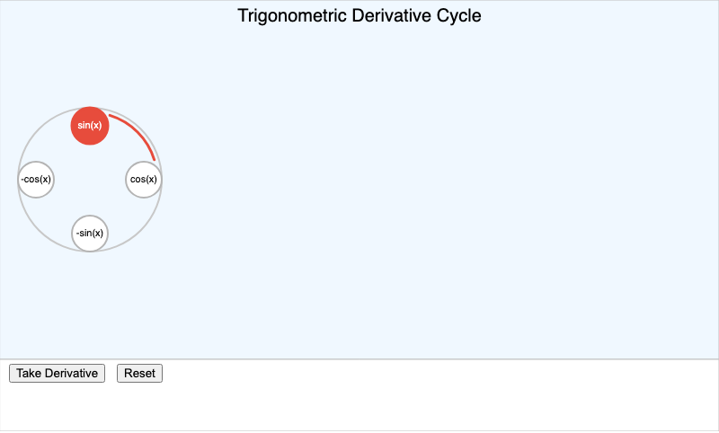

    Interactive visualization showing the cyclic pattern of trigonometric derivatives.

-   **[Trig Derivatives Flashcards](./trig-derivatives-card/index.md)**

    

    Interactive flashcard-style reference for memorizing derivatives of the six trigonometric functions.

-   **[Trig Graph Transformer](./trig-graph-transformer/index.md)**

    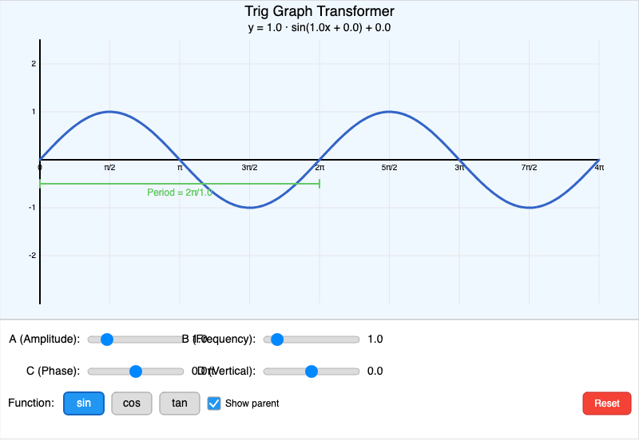

    Manipulate amplitude, period, phase shift, and vertical shift for trigonometric functions.

-   **[Trig Identity Visualizer](./trig-identity-visualizer/index.md)**

    

    See the Pythagorean identity sin^2 + cos^2 = 1 geometrically using the unit circle.

-   **[Trig Integral Reference](./trig-integral-reference/index.md)**

    

    Interactive reference showing all six basic trig integrals with visual connections to their derivatives.

-   **[Two Moving Objects Distance](./two-moving-objects-distance/index.md)**

    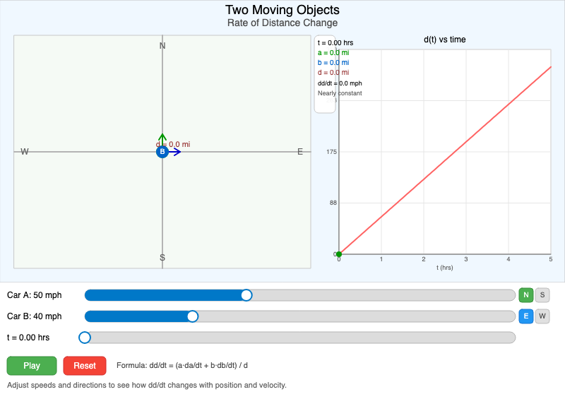

    Interactive visualization examining how the rate of distance change between two moving objects depends on their positions and velocities.

-   **[u-Substitution Steps](./u-substitution/index.md)**

    

    Interactive step-by-step guide to applying u-substitution for evaluating integrals.

-   **[Interactive Unit Circle](./unit-circle/index.md)**

    

    Explore the relationship between angles and sine/cosine values with connected graph visualizations.

-   **[Verification Methods Comparison](./verification-methods/index.md)**

    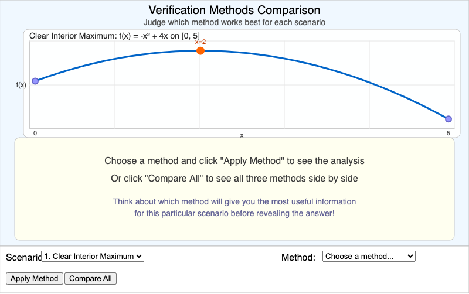

    An interactive MicroSim that helps students judge which verification method is most appropriate for different optimization scenarios.

-   **[Vertical Asymptote Explorer](./vertical-asymptote/index.md)**

    

    Interactive visualization showing how one-sided limits determine function behavior near vertical asymptotes.

-   **[Vertical Line Test](./vertical-line-test/index.md)**

    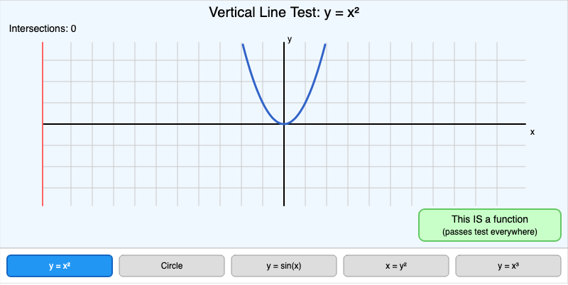

    Interactive tool for testing whether graphs represent functions using the vertical line test.

-   **[Zoom to Linear](./zoom-to-linear/index.md)**

    

    An interactive MicroSim demonstrating that sufficiently zoomed-in views of differentiable functions appear linear.

---

## About MicroSims

MicroSims are lightweight, interactive educational simulations designed for browser-based learning. Each MicroSim:

- Focuses on a single learning objective
- Provides immediate visual feedback
- Works on any device with a modern browser
- Can be embedded in any webpage via iframe

All MicroSims in this course use open-source JavaScript libraries (primarily p5.js) so students can view the source code and learn from the implementations.

**Total MicroSims:** 123
